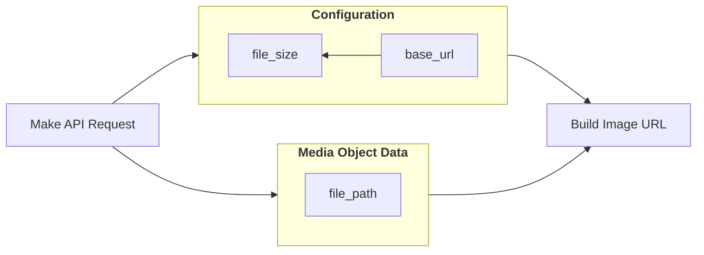

## Image URL
You'll notice that movie, TV, and person objects contain references to different file paths. 
In order to generate a fully working image URL, you'll need 3 pieces of data. 
Those pieces are:
- `base_url`
- `file_size` 
- `file_path`

The first two pieces can be retrieved by calling the [configuration](https://ileolami.mintlify.app/api-reference/configuration/details) API and the third piece is the file path you get from a particular media object.


Here's what a full image URL looks like if the poster_path of `/1E5baAaEse26fej7uHcjOgEE2t2.jpg` was returned for a movie, and you were looking for the w500 size:

```shell Example
   https://image.tmdb.org/t/p/w500/1E5baAaEse26fej7uHcjOgEE2t2.jpg
```
## Company And Network Logo URL
Company and network logos are available in two formats:
- SVG 
- PNG

All of the `logo_path` fields will return a `.png`. This is to maintain backwards compatibility since SVG support was added after the fact.
When looking at the image methods there is a new field called `file_type` that will show you the original version of the asset that was uploaded. For SVG's, you should call the original image size since we don't resize them. 
If you prefer to grab `PNG's`, you can call any size you wish just like normal.

For example,you can call Netflix's logo (`wwemzKWzjKYJFfCeiB57q3r4Bcm.svg`) through these following:
``` shell Example
  https://image.tmdb.org/t/p/original/wwemzKWzjKYJFfCeiB57q3r4Bcm.svg
  https://image.tmdb.org/t/p/original/wwemzKWzjKYJFfCeiB57q3r4Bcm.png
  https://image.tmdb.org/t/p/w500/wwemzKWzjKYJFfCeiB57q3r4Bcm.png
```


