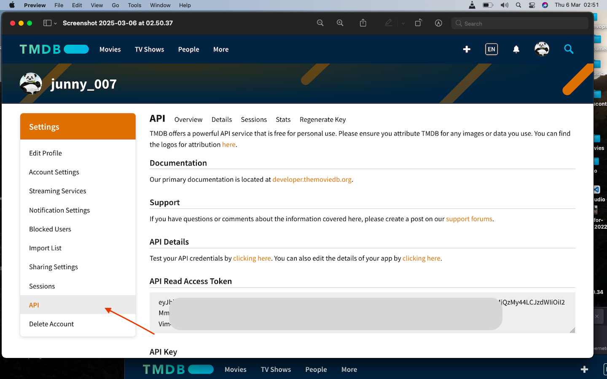

Application-level authentication is generally the default method for authenticating with the API. 
Version 3 can be controlled either by a single query parameter, `api_key`, or by using your access token as a `Bearer` token. 
You can request an API key by logging into your TMDB account and clicking [here](https://www.themoviedb.org/settings/api).

## Bearer Token
The default method to authenticate is with your access token. 
Go to your account page, under the `API settings` section, and you will see a new token listed called `API Read Access Token`. This token should be sent as an `Authorization` header. 
<Frame></Frame>

Here is a simple cURL example using this method:

```shell cURL example
curl --request GET \
     --url 'https://api.themoviedb.org/3/movie/11' \
     --header 'Authorization: Bearer {ACCESS_TOKEN}'
```